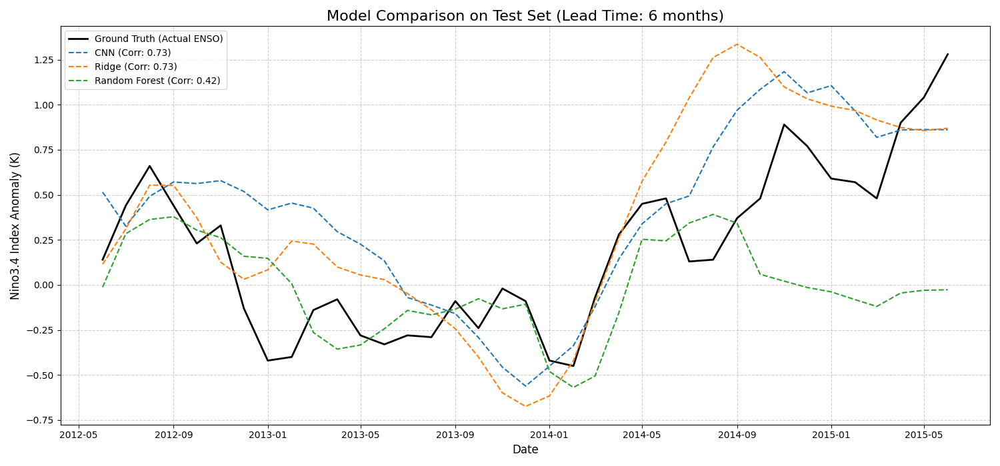

## Results

The models were trained and evaluated on the test set (`2011-2017`). The results highlight a classic bias-variance tradeoff.

| Lead Time | Model           | Pearson Correlation | RMSE  |
| :-------- | :-------------- | :------------------ | :---- |
| **6 Months**  | CNN             | 0.729               | 0.398 |
|           | Ridge (PCA)     | 0.734               | 0.423 |
|           | Random Forest (PCA) | 0.419           | 0.464 |
| **36 Months** | CNN             | **-0.401**          | 1.346 |
|           | Ridge (PCA)     | 0.169               | 1.073 |
|           | Random Forest (PCA) | **0.747**       | 0.958 |

### Key Observations
- The CNN and Ridge models show strong performance on short-term forecasts (1-12 months).
- The CNN exhibits classic **overfitting** (high variance), where its performance collapses on long-term forecasts.
- The simpler Ridge model provides a more stable, though weaker, baseline at long lead times.

### Model Comparison Plot (6-Month Forecast)
